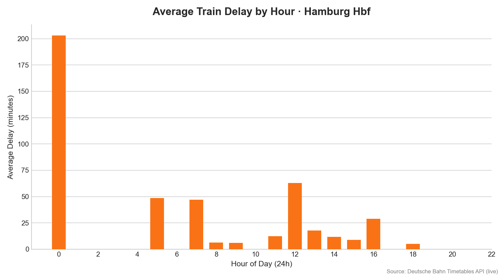

# 🚂 DB-Delay-Tracker: Hamburg Hbf Analysis

> **Data pipeline for monitoring and visualising train reliability at Hamburg Hauptbahnhof.**

## 📊 Project Overview
Every 15 minutes a scheduled job polls the Deutsche Bahn Timetables API for
Hamburg Hbf, joins the **planned timetable** against the **live change feed**,
and upserts one row per train into a growing dataset (`hamburg_delays.csv`).
A Python pass turns that into delay statistics.

## 📈 Results

*Average delay by hour, generated straight from the dataset by `scripts/analyze_delays.py`.*

---

## 🛠️ The Tech Stack
* **Python + `requests`:** Polls two Timetables API endpoints and merges them.
* **pandas:** Parses the API's timestamp format, computes delays, de-duplicates.
* **matplotlib:** Renders the hourly delay chart above.
* **PowerShell + Task Scheduler:** Runs the collector every 15 min and pushes the CSV.

---

## 🗂️ Dataset schema (`hamburg_delays.csv`)
| column | meaning |
|---|---|
| `check_time` | when the poll that produced this row ran |
| `train_id` | DB stop id (unique per train run — the upsert key) |
| `category` | ICE / IC / RE / RB / ME … |
| `line` | line label (RE8, RB81, …) |
| `train_no` | train number |
| `planned_arr` | scheduled arrival at Hamburg Hbf |
| `actual_arr` | current/estimated arrival (equals `planned_arr` when nothing changed) |
| `delay_min` | `actual_arr − planned_arr` in minutes (blank if planned time unknown) |
| `cancelled` | 1 if the stop was cancelled |
| `platform` | arrival platform |
| `origin` | first station on the train's route |
| `source` | `live` (current pipeline) or `legacy` (migrated May/Aug capture) |

---

## 🔍 Engineering Challenges & Solutions

### 1. The change feed has no planned times
* **Challenge:** `/fchg` returns *changes only* — a current arrival estimate
  (`ct`) but almost never the original planned time (`pt`). On its own ~88% of
  rows can't produce a delay figure.
* **Solution:** also pull `/plan/{eva}/{date}/{hour}` for the previous, current
  and next hour and join on the stop id. A train first seen outside that window
  with no planned time is back-filled automatically on a later run (the upsert
  keys on `train_id`).

### 2. The "Zombie Train" problem (data latency)
* **Challenge:** the API occasionally echoes stale records — trains from 12+
  hours ago that never cleared the system.
* **Solution:** `analyze_delays.py` compares each record's `check_time` against
  its `planned_arr` and drops anything more than 12 h apart before averaging.

### 3. Integer-to-datetime transformation
* **Challenge:** the API returns timestamps as `YYMMDDHHMM` integers; naïve
  subtraction breaks at hour/day boundaries and some records omit the planned time.
* **Solution:** `pandas.to_datetime(..., format='%y%m%d%H%M', errors='coerce')`
  parses into real datetimes; rows that fail to parse are dropped, not crashed on.

### 4. Excel corrupted an earlier capture
* **Challenge:** an early `hamburg_delays.csv` was round-tripped through Excel,
  which coerced ~48% of the train ids into floats like `-8.4E+18` and rewrote the
  dates as `DD/MM/YYYY`.
* **Solution:** `scripts/clean_merge.py` drops the unrecoverable ids, normalises
  both timestamp styles, collapses each capture to one row per train, tags it
  `source=legacy`, and merges it under the live data.

---

## ▶️ Usage

### One-off
```bash
# 1. Put DB_CLIENT_ID / DB_API_KEY in a local .env (git-ignored)
pip install -r requirements.txt        # requests, pandas, matplotlib, python-dotenv

# 2. Collect once (appends/updates hamburg_delays.csv)
python scripts/hamburg_collector.py

# 3. Refresh the summary + chart
python scripts/analyze_delays.py

# 4. (once) migrate the legacy May/August captures into the current schema
python scripts/clean_merge.py
```

### Run it on a schedule (Windows)
```powershell
# registers a task that runs collect_and_push.ps1 every 15 min while you're logged in
powershell -ExecutionPolicy Bypass -File scripts\install_task.ps1
# remove:  Unregister-ScheduledTask -TaskName "HamburgDelaysCollector"
```
`collect_and_push.ps1` runs the collector, then commits and pushes
`hamburg_delays.csv` only when it changed. Activity is logged to `collector.log`.
